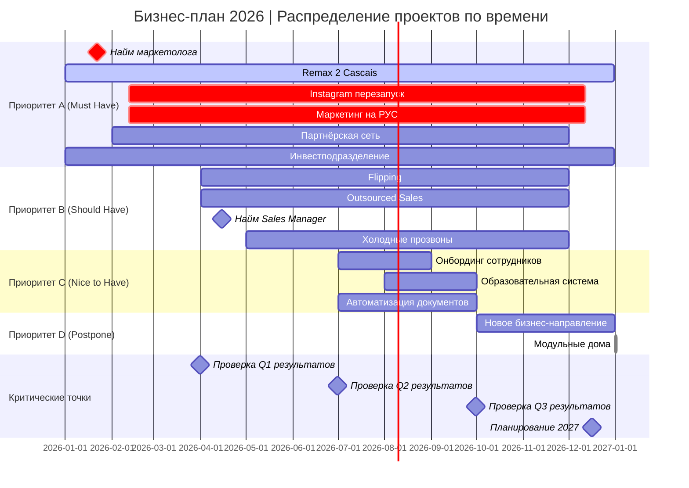
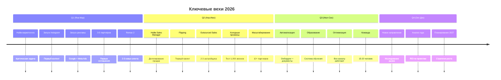
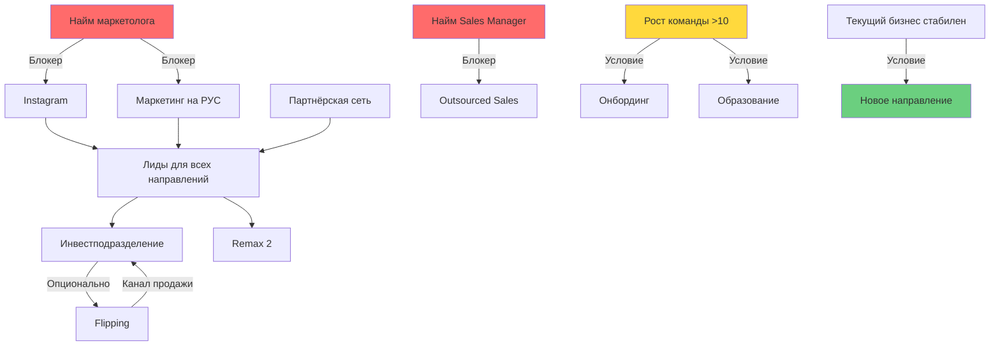
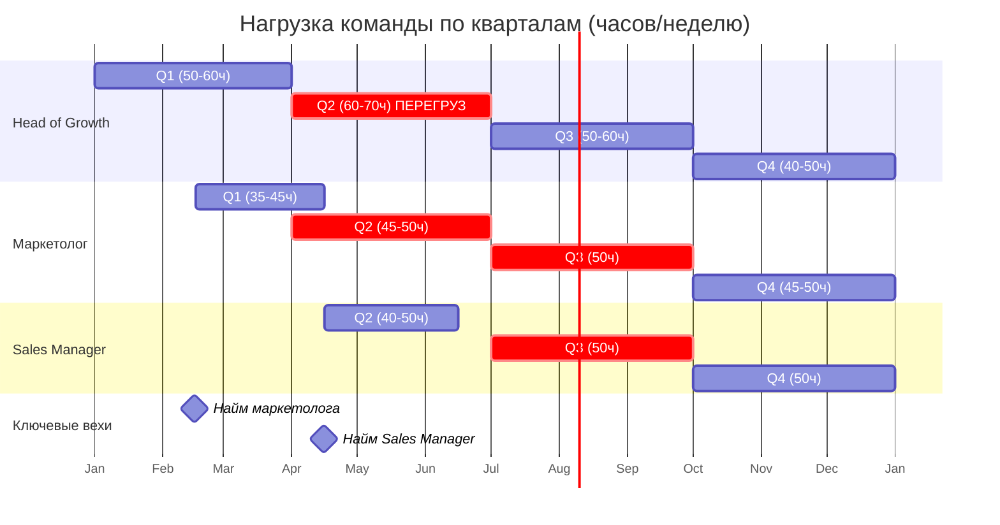
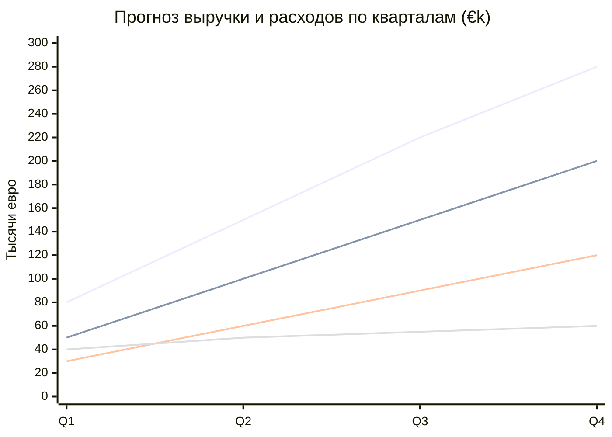
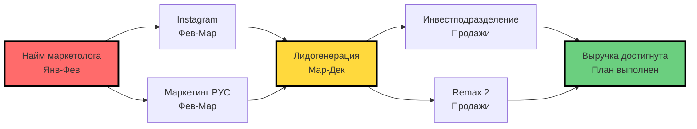

# ВИЗУАЛИЗАЦИЯ ПЛАНА | GANTT CHART И ДИАГРАММЫ

**Цель:** Наглядно показать распределение проектов по кварталам, зависимости и критический путь.

---

## 📊 GANTT CHART: ГОДОВОЙ ПЛАН



---

## 📈 ВРЕМЕННАЯ ЛИНИЯ ПО КВАРТАЛАМ



---

## 🔄 ЗАВИСИМОСТИ ПРОЕКТОВ (ГРАФ)



**Легенда:**
- 🔴 Красный: Критические блокеры (без них проект не начнётся)
- 🟡 Жёлтый: Условные зависимости
- 🟢 Зелёный: Можно запускать независимо

---

## 📊 РАСПРЕДЕЛЕНИЕ НАГРУЗКИ ПО КВАРТАЛАМ



---

## 🎯 ПРИОРИТИЗАЦИЯ ПРОЕКТОВ (МАТРИЦА EISENHOWER)

```mermaid
quadrantChart
    title Матрица приоритетов: Срочность vs Важность
    x-axis Низкая срочность --> Высокая срочность
    y-axis Низкая важность --> Высокая важность
    
    quadrant-1 DO NOW (Q1)
    quadrant-2 SCHEDULE (Q2-Q3)
    quadrant-3 DELEGATE (Подрядчики)
    quadrant-4 ELIMINATE (Отложить)
    
    Instagram: [0.8, 0.9]
    Маркетинг РУС: [0.85, 0.9]
    Инвестподразделение: [0.7, 0.95]
    Партнёрская сеть: [0.6, 0.8]
    Remax 2: [0.75, 0.85]
    Flipping: [0.4, 0.6]
    Outsourced Sales: [0.5, 0.65]
    Холодные прозвоны: [0.45, 0.6]
    Онбординг: [0.3, 0.4]
    Образование: [0.35, 0.45]
    Автоматизация: [0.25, 0.4]
    Новое направление: [0.2, 0.5]
    Модульные дома: [0.1, 0.3]
```

---

## 💰 ФИНАНСОВАЯ ПРОЕКЦИЯ (УПРОЩЁННАЯ)



**Комментарий:**
- **Оптимистичная:** Все каналы работают отлично, high deal flow
- **Реалистичная:** 70% проектов работают, средний deal flow
- **Пессимистичная:** Много задержек, маркетинг не взлетел сразу

---

## 🚦 СВЕТОФОР ПРОЕКТОВ (СТАТУС ПО КВАРТАЛАМ)

| Проект | Q1 | Q2 | Q3 | Q4 |
|--------|----|----|----|----|
| Remax 2 | 🟡 Стабилизация | 🟢 Рост | 🟢 Масштаб | 🟢 Работает |
| Инвестподразделение | 🟡 Запуск | 🟢 Рост | 🟢 Работает | 🟢 Работает |
| Instagram | 🟡 Запуск | 🟢 Рост | 🟢 Работает | 🟢 Работает |
| Маркетинг РУС | 🟡 Запуск | 🟢 Оптимизация | 🟢 Работает | 🟢 Работает |
| Партнёрская сеть | 🟡 Запуск | 🟢 Рост | 🟢 Работает | 🟢 Работает |
| Flipping | ⚪ Не начат | 🟡 Запуск | 🟢 Работает | 🟢 Работает |
| Outsourced Sales | ⚪ Не начат | 🟡 Запуск | 🟢 Работает | 🟢 Работает |
| Холодные прозвоны | ⚪ Не начат | 🟡 Тест | 🟢 Масштаб | 🟢 Работает |
| Онбординг | ⚪ Не начат | ⚪ Не начат | 🟡 Разработка | 🟢 Работает |
| Образование | ⚪ Не начат | ⚪ Не начат | 🟡 Разработка | 🟢 Работает |
| Автоматизация | ⚪ Не начат | ⚪ Не начат | 🟡 Внедрение | 🟢 Работает |
| Новое направление | ⚪ Не начат | ⚪ Не начат | ⚪ Не начат | 🟡 Исследование |
| Модульные дома | 🔴 Отложено | 🔴 Отложено | 🔴 Отложено | 🔴 Отложено |

**Легенда:**
- ⚪ Не начат
- 🟡 В процессе запуска/разработки
- 🟢 Активно работает
- 🔴 Отложено/Остановлено

---

## 📅 КАЛЕНДАРЬ КЛЮЧЕВЫХ СОБЫТИЙ 2026

### Январь
- **Неделя 1-2:** Поиск маркетолога начат
- **Неделя 3-4:** Remax 2: найм агентов, планирование

### Февраль
- **Неделя 1-2:** Маркетолог нанят, онбординг
- **Неделя 3-4:** Instagram: первый контент, лендинги в разработке

### Март
- **Неделя 1-2:** Реклама запущена (Google + Meta)
- **Неделя 3-4:** **КРИТИЧЕСКАЯ ТОЧКА:** Проверка Q1, есть ли лиды?

### Апрель
- **Неделя 1-2:** Решение: Flipping go/no-go
- **Неделя 3-4:** Найм Sales Manager начат

### Май
- **Неделя 1-2:** Sales Manager нанят
- **Неделя 3-4:** Холодные прозвоны: первые 500 звонков

### Июнь
- **Неделя 1-2:** Outsourced Sales: первые сделки
- **Неделя 3-4:** **КРИТИЧЕСКАЯ ТОЧКА:** Проверка Q2, масштабировать или корректировать?

### Июль
- **Неделя 1-2:** Анализ первого полугодия
- **Неделя 3-4:** Автоматизация: разработка начата

### Август
- **Неделя 1-4:** Онбординг + Образование в разработке

### Сентябрь
- **Неделя 1-2:** Тестирование автоматизаций
- **Неделя 3-4:** **КРИТИЧЕСКАЯ ТОЧКА:** Проверка Q3, готовы к Q4?

### Октябрь
- **Неделя 1-4:** Исследование нового бизнес-направления

### Ноябрь
- **Неделя 1-2:** Встречи с инвесторами (если нужно)
- **Неделя 3-4:** Финансовый анализ года

### Декабрь
- **Неделя 1-2:** Планирование 2027
- **Неделя 3-4:** Подведение итогов, бонусы команде

---

## 🎯 КРИТИЧЕСКИЙ ПУТЬ (CRITICAL PATH)

**Проекты, от которых зависит успех всего плана:**



**Вывод:** Если маркетолог не нанят к февралю → весь план сдвигается на 2–3 месяца → риск не выполнить годовые цели.

---

## 📊 СРАВНЕНИЕ СЦЕНАРИЕВ

### Сценарий 1: ВСЁ ПО ПЛАНУ (14 проектов)
**Результат:** 🔴 Перегруз команды, burnout, 50% проектов провалены

### Сценарий 2: ФОКУС НА ПРИОРИТЕТЕ A (6 проектов)
**Результат:** 🟢 Все 6 проектов выполнены качественно, устойчивый рост

### Сценарий 3: ПРИОРИТЕТ A + B (8 проектов)
**Результат:** 🟡 Приемлемо, но требует найма Sales Manager к Q2

**Рекомендация:** Сценарий 3 — оптимальный баланс между амбициями и реальностью.

---

## 🗺 ROADMAP ДЛЯ MIRO (СТРУКТУРА)

Если вы хотите перенести это в Miro, вот структура:

### Колонка 1: Q1 (Янв-Мар)
- **Блок:** Найм маркетолога (красный, критичный)
- **Блок:** Instagram перезапуск
- **Блок:** Маркетинг на РУС
- **Блок:** Партнёрская сеть
- **Блок:** Remax 2 стабилизация
- **Блок:** Инвестподразделение запуск

### Колонка 2: Q2 (Апр-Июн)
- **Блок:** Найм Sales Manager (красный, критичный)
- **Блок:** Flipping (условно)
- **Блок:** Outsourced Sales
- **Блок:** Холодные прозвоны
- **Блок:** Масштабирование маркетинга

### Колонка 3: Q3 (Июл-Сен)
- **Блок:** Автоматизация онбординга
- **Блок:** Образовательная система
- **Блок:** Автоматизация документов
- **Блок:** Оптимизация всех каналов

### Колонка 4: Q4 (Окт-Дек)
- **Блок:** Новое бизнес-направление (исследование)
- **Блок:** Анализ года
- **Блок:** Планирование 2027

**Стрелки между блоками:** Показывают зависимости (кто от кого зависит)

---

**Следующий документ:** Финальные рекомендации и план действий

**Статус:** Визуализация готова  
**Дата:** 08.01.2026
